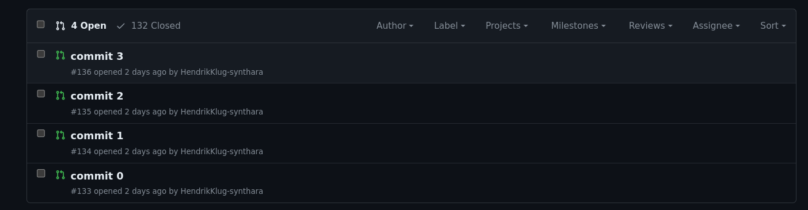
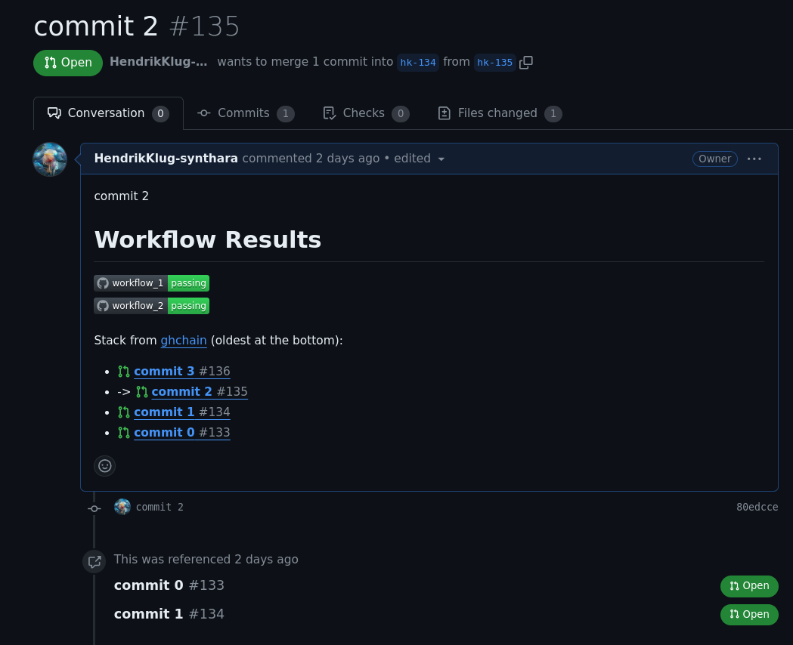

# ghchain

ghchain automates the creation of chained pull requests for each commit in your development branch, facilitating a clear and organized review process.
This tool is heavily inspired by [ghstack](https://github.com/ezyang/ghstack) and further details on the concept of stacked pull requests can be found in [this blog post](https://stacking.dev/).

# Features

-   **Automated Branch Creation**: Creates a new branch for each commit on your development branch.
-   **Pull Request Management**: Automatically creates a GitHub pull request for each branch, stacking them sequentially for streamlined review.
-   **Configurable Workflows**: Supports custom GitHub Actions workflows via `.ghchain.toml` for automated testing and checks.
-   **Dynamic Branch Naming**: Configurable branch naming schemes to match your project's conventions.
-   **Issue Link Detection**: Customizable regex patterns to detect linked issues in commit messages.
-   **Logging**: Detailed logging to track the process of ghchain.
-   **git notes**: ghchain adds a [git note](https://git-scm.com/docs/git-notes) to each commit with
    -   the PR number, to easily track the PRs.
    -   workflow status, to see if the workflows have passed.
    -   status checks, to see if the status checks have passed.

# Configuration

Configure ghchain using a .ghchain.toml file in the root of your repository.
Current configuration options include:

```toml
workflows = []  # List of GitHub Actions workflows to run with the tests flags
base_branch = "origin/main"  # Base branch for the PRs
branch_name_template = "{git_config_author}-{pr_id}"  # Template for naming branches, customizable to include author name and a PR identifier.
delete_branch_after_merge = true  # Whether to delete the branch after the PR is merged
log_file = "path/to/ghchain.log"  # Path to the log file
log_level = "INFO"  # Logging level
# Regex pattern to detect linked issues in commit messages.
# This one is for the default pattern of "(#<issue_number>)"
issue_pattern = "\\\\(#(\\\\d+)\\\\)"
```

# Usage

```bash
$ ghchain --help
Usage: ghchain [OPTIONS] COMMAND [ARGS]...

  Create a branch for each commit in the stack that doesn't already have one.
  Optionally, create a PR for each branch and run the github workflows that
  are specified in the .ghchain.toml config of the repository.

  Usage:

  ghchain: will create a branch for each commit in the stack that doesn't
  already have one and push it to the remote.

  ghchain --create-pr: will create a branch for each commit in the stack that
  doesn't already have one, push it to the remote and create a PR for each
  branch.

  ghchain --draft: will create a branch for each commit in the stack that
  doesn't already have one, push it to the remote and create a draft PR for
  each branch.

  ghchain --with-tests: will create a branch for each commit in the stack that
  doesn't already have one, push it to the remote and run the github workflows
  that are specified in the .ghchain.toml config of the repository.

Options:
  -p, --create-pr  If set to True, a pull request will be opened for every
                   commit.
  --draft          Create the pull request as a draft. This flag sets
                   --create-pr to True.
  --with-tests     Run the github workflows that are specified in the
                   .ghchain.toml config of the repository.
  --help           Show this message and exit.

Commands:
  fix-refs        If you messed up your stack with a rebase and lost the...
  fixup           Commands to fixup a commit and rebase the stack.
  land            Merge the specified branch into the configured base...
  process-commit  Process a single commit by its SHA.
  publish         Publish all updated branches in the stack to the remote.
  rebase          Rebase the current branch onto branch, using...
  refresh         Update the commit notes with the PR/ workflow statuses...
  run-workflows   Run the github workflows that are specified in the...
```

## Usage Example

Let's say that you're working on your dev branch `mydev` and you've cleaned up your changes into 4 commits:

```
git log main..mydev

>> commit 64bd042e9d7be39a180bcb7d0a788c23b75682fd (HEAD -> mydev)
>> Author: Hendrik Klug
>> Date:   Sat Apr 13 14:27:25 2042 +0200
>>
>>     commit 3
>>
>> commit 80edccef17a7086b7a90b03bf18a5c763adf741f
>> Author: Hendrik Klug
>> Date:   Sat Apr 13 14:27:25 2042 +0200
>>
>>     [feat] commit 2 (#2558)
>>
>> commit b64c30667ad23847e981e4c9bafe8eee3ffb0881
>> Author: Hendrik Klug
>> Date:   Sat Apr 13 14:27:25 2042 +0200
>>
>>     commit 1
>>
>> commit 51d6204578eacb3ee78fd1488e367e37bb20b492
>> Author: Hendrik Klug
>> Date:   Sat Apr 13 14:27:25 2042 +0200
>>
>>     commit 0

```

> [!NOTE]
> "commit 2" references issue #2558 in the commit message. Ghchain will use this information to link the branch or PR to the issue.

You would like to make the life of the reviewer easier by creating a pull request for each commit.
Running `ghchain -p` will create a new branch for each commit and create a pull request for each of those branches:

```
git log main..mydev

commit 64bd042e9d7be39a180bcb7d0a788c23b75682fd (HEAD -> mydev, origin/hk-136, hk-136)
Author: Hendrik Klug
Date:   Sat Apr 13 14:27:25 2042 +0200

    commit 3

commit 80edccef17a7086b7a90b03bf18a5c763adf741f (origin/hk-135, hk-135)
Author: Hendrik Klug
Date:   Sat Apr 13 14:27:25 2042 +0200

    [feat] commit 2 (#2558)

Notes:
    [ghchain]
    issue = https://github.com/HendrikKlug-synthara/mytest/issues/2558

commit b64c30667ad23847e981e4c9bafe8eee3ffb0881 (origin/hk-134, hk-134)
Author: Hendrik Klug
Date:   Sat Apr 13 14:27:25 2042 +0200

    commit 1

commit 51d6204578eacb3ee78fd1488e367e37bb20b492 (origin/hk-133, hk-133)
Author: Hendrik Klug
Date:   Sat Apr 13 14:27:25 2042 +0200

    commit 0

```

> [!NOTE]
> The pull request that was created for `commit 2` will automatically have a reference to issue #2558.
> The commit also has a [git note](https://git-scm.com/docs/git-notes) with the issue link.
> You can configure the issue pattern with which linked issues are detected in the `.ghchain.toml` file.

> [!NOTE]
> The `with-tests` flag can also be passed to `ghchain process-commits`. If it is passed all workflows defined in the `.ghchain.toml` file will be run for each commit.

The pull requests then look like the following (see [my test repo](https://github.com/HendrikKlug-synthara/mytest/pulls) for reference):


A single pull request, with the `with-tests` flag passed, will look like this:


### Fixing commits

Your reviewer is verry happy with your small pull request, but would like you to fix a small issue in `commit 1`.
You can fix this issue in two ways:

#### With `ghchain fixup`

`ghchain` implements a wrapper around the `git rebase --onto` command to easily fix a commit:

```shell
$ ghchain fixup --help
  Commands to fixup a commit and rebase the stack.

  Wrapper around "git rebase --onto <bottom-branch> <old-base> <top-branch>"
  to rebase the stack onto a modified commit.

  Example usage:

      1. To fix a commit of branch 'feature-branch':
         $ ghchain fixup start feature-branch

      2. Make your changes and stage them:
         $ git add <modified-files>
         $ git commit --amend --no-edit

      3. Complete the fixup and rebase the stack:
         $ ghchain fixup done

Options:
  --help  Show this message and exit.

Commands:
  done   Complete the fixup process and rebase the stack.
  start  Start the fixup process for a specific commit or branch.

```

`commit 1` belongs to the branch `hk-134`.
Running `ghchain fixup start hk-134` will checkout `hk-134` but keep track of the old ref.
Make the changes to the commit and run `ghchain fixup done` to rebase the stack on top of the new commit.

#### Manually

You stash your new changes from `mydev` and checkout the branch `hk-134`.
You fix the issue with either `git commit --amend` or `git commit --fixup b64c30667ad23847e981e4c9bafe8eee3ffb0881` and push the changes.

To rebase your whole stack on top of the new commit, you can checkout your `mydev` branch and run `ghchain rebase hk-134`.
This will run a `git rebase --update-refs hk-134` and push the changes to the remote, hence updating your pull requests.

> [!NOTE]
> You can also pass the --interactive flag to the rebase command to run an interactive rebase.

### Checking the status of the PRs/Commits

You can run `ghchain refresh` to update the [git notes](https://git-scm.com/docs/git-notes) of your commits.
This will update the workflow status and the status checks of each commit.
`git log` will then show the following:

```shell

commit 51d6204578eacb3ee78fd1488e367e37bb20b492 (origin/hk-133, hk-133)
Author: Hendrik Klug
Date:   Sat Apr 13 14:27:25 2042 +0200

    commit 0

Notes:
    [ghchain]
    pr url = https://github.com/HendrikKlug-synthara/mytest/pull/1961
    Review Decision =
    Mergable = MERGEABLE
    is_draft = False
    title = commit 0

    [[workflow_statuses]]

    | name       | status   | conclusion   |
    |:-----------|:---------|:-------------|
    | workflow_1 | ✅        | ✅            |
    | workflow_2 | ✅        | ✅            |

```

## Installation

> [!CAUTION]
> ghchain uses the github cli [gh](https://cli.github.com/) to interact with the github api.\
> It needs to be installed and configured before `ghchain` can be used.

### pip release version

```bash
pip install ghchain
```

### pip live version

```bash
pip install git+https://github.com/Jimmy2027/ghchain.git
```

### portage

`ghchain` is available via [Jimmy's overlay](https://github.com/Jimmy2027/overlay/blob/ae539a3c98d3e95fb0cfa8945344ff705c0537a1/dev-python/ghchain/ghchain-9999.ebuild).
Either enable the repo or copy the ebuild to your local overlay.

Then run:

```bash
emerge -av ghchain
```
